# Assassin

## Skills (PVE)

Notes:

- Drop minor damage nodes for life leech if needed.
- **Lv20 priority:** Heart Gore > Insignia Explosion > Quick Slice

| Skill | Icon | Lvl | Specialty |
|---|---|---|---|
| **Quick Slice** | 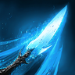 | 20 | • +50% Multi-Hit on hit • -1s [Insignia Explosion] cooldown on hit • Ignores Block and Evasion and lands as a Critical Hit |
| **Savage Roar** | 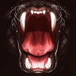 | 20 | • +20% Skill Speed • Deals up to 12% more damage when fewer targets are hit |
| **Shadowstrike** | 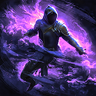 | 12 | • +20% caster Critical Damage Boost for 5s on hit • 50% chance to inflict Seal for 5s on hit |
| **Ambush** | 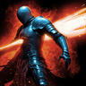 | 12 | • Engraves 2 Insignias for 10s on landing as a Back attack • Absorbs 3% HP |
| **Heart Gore** | 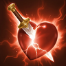 | 20 | • Engraves 1 Insignia for 10s on hit • Multi-Hit on hit • Resets [Heart Gore] cooldown on landing a Critical Hit |
| **Storm Rampage** | 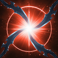 | 16 | • Multi-Hit on hit • -1s all skill cooldowns on hit |
| **Whirlwind Slice** | 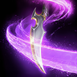 | 12 | • +50% Multi-Hit on hit • +16m range |
| **Flash Slice** |  | 12 | • +6m Range • +1 consecutive use |
| **Infiltrate** |  | 12 | • Restores 300 Stamina on landing [Infiltrate] • +10m [Infiltrate] range |
| **Shadow Fall** | 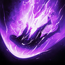 | 12 | • Absorbs 10% HP • Engraves 3 Insignias for 10s on hit |
| **Insignia Explosion** | 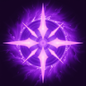 | 20 | • +50% Multi-Hit on hit • Keep 2 stacks of Insignias after [Insignia Explosion] • -3s cooldown |
| **Defiance** |  | 12 | • Restores 20% HP on using [Defiance] • +50% PvE Damage Tolerance and +25% PvP Damage Tolerance for Tenacity duration |

## Passives (PvE)

Notes:

- **Prioritize Bold Passives:** Rear Smite > Assault Stance > Impact Hit > Exploit Weakness

| Passive | Icon | Lvl | Description |
|---|---|---|---|
| **Rear Smite** |  | 30 | Increases the caster's Back Attack Damage Boost by 3%, PvE Damage Boost by 3%, and PvP Damage Boost by 1.5%. |
| **Assault Stance** | 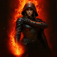 | 28 | Increases the caster's Critical Damage Boost by 6%. |
| **Impact Hit** | 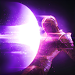 | 21 | Increases the caster's Impact-type Chance by 11.2% and Double Chance by 0.3%. |
| **Exploit Weakness** |  | 16 | Increases the caster's Critical Hit by 100. Has a 25% chance to increase Attack by 5.5% for 10s, and a 7% chance to summon up to 5 clones on landing a Critical Hit. Each clone deals 17-17 damage and inflicts Insignia that lasts for 10s (up to 5 Insignia stacks). Clone cooldown: 1s Attack increase cooldown: 1s |
| **Heightened Sixth Sense** | 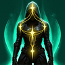 | 16 | Increases the caster's Evasion by 200 and HP by 150. Increases Max HP by an extra 1.5% and restores 85-102 HP on Evasion. Cooldown: 3s |
| **Apply Poison** | 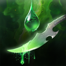 | 9 | Has a 15% chance to reduce the target's incoming healing by 12% and inflict Poison for 10s on landing an attack. Poison deals 23\~23 Damage over Time every 1s. Cooldown: 1s |
| **Ambush Stance** | 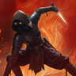 | 14 | Grants Ambush Stance for 10s when using skills that rush or involve movement. Ambush Stance: Has a 50% chance to deal 152-152 damage on landing an attack. Cooldown: 1s |
| **Defense Break** | 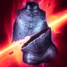 | 17 | Reduces the target's Defense by 12% and Status Effect Resist by 11% for 10s when landing an attack on a target afflicted with Stagger or an Impact-type status. Cooldown: 20s |
| **Revitalization Contract** | 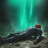 | 16 | Increases the caster's Status Effect Resist by 17%. Increases Status Effect Resist by 10% for 5s when hit while afflicted with Stun, Knockdown, Airborne, Frost, or Fear (up to 10 stacks). Immediately restores 35% Max HP when HP is 10% or less. Healing Cooldown: 60s Status Effect Resist Cooldown: 1s |
| **Determination** |  | 14 | Deals 228-228 damage when landing an attack on a target with 30% HP or less. Cooldown: 1s |

## Stigmas (PvE)

Notes:

- **Lv20 Priority** Illusive Clone > Swift Contract > Triniel's Dagger

🟥- Mandatory 🟦- Situational 🟫- Don’t Use

| Stigma | Icon | Lvl | Notes | Category |
|---|---|---|---|---|
| **Savage Fang** |  |  | 4th Prio | 🟥 Mandatory |
| **Swift Contract** | 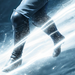 |  | Duo Buff with Illusive Clone 2nd Prio | 🟥 Mandatory |
| **Evasion Stance** | 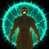 |  | 5th Prio - Raid situational | 🟥 Mandatory |
| **Triniel’s Dagger** | 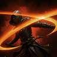 |  | 3rd Prio | 🟥 Mandatory |
| **Illusive Clone** | 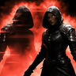 |  | Big Buff 1st Prio | 🟥 Mandatory |
| **Smoke Bomb** | 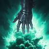 |  | Good filler, first pick after mandatory stigmas | 🟦 Situational |
| **Throw Shadowblade** | 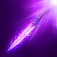 |  | Slot instead of evasion or smoke bomb to farm | 🟦 Situational |
| **Spiral Slice** |  |  | PvP skill | 🟦 Situational |
| **Shadow Walk** |  |  | PvP skill | 🟦 Situational |
| **Shadow Step** | 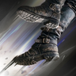 |  | PvP skill | 🟦 Situational |
| **Evasion Contract** | 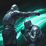 |  | PvP skill | 🟦 Situational |
| **Aerial Bind** | 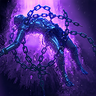 |  | Niche PvP skill | 🟦 Situational |
| **Assault Ambush** |  |  | Ignore; useless | 🟫 Don't use |

## Macros

- Mouse macro software to spam LMB alongside the in-game macro to weave

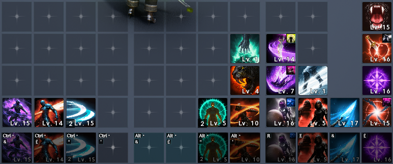

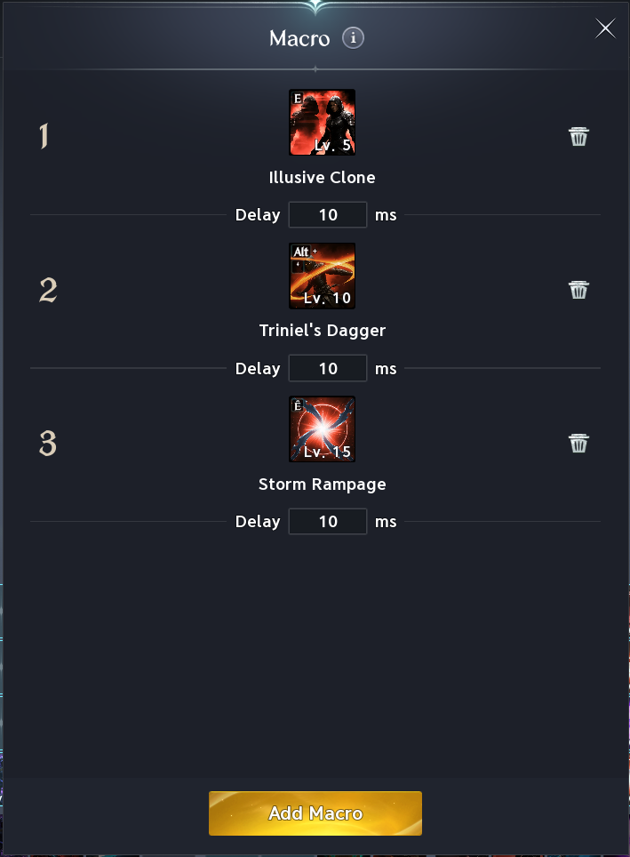
