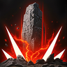
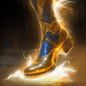
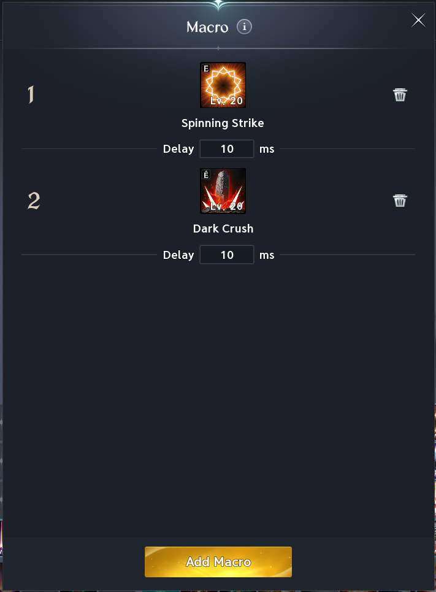
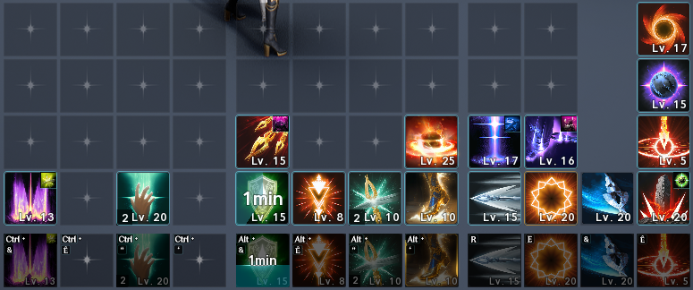

# Chanter

## Skills (PVE)

Notes:

- **Lv20 leveling priority** Dark Crush > Recuperation > Onslaught > Spinning Strike

| Skill | Icon | Lvl | Specialty |
|---|---|---|---|
| **Onslaught** |  | 20 | • +50% Multi-Hit on hit • -1s [Spinning Strike] cooldown on hit • Adds [Storm Chain] Chain Skill |
| **Incandescent Blow** |  | 16 | • Deals up to 12% more damage when fewer targets are hit • Ignores Block and Evasion and lands as Multi-Hit |
| **Rushing Smash** |  | 16 | • Resets cooldown on defeating an enemy • Ignores Block and Evasion and lands as Multi-Hit |
| **Impactful Crush** |  | 12 | • Changes to mobile skill • +30% Skill Speed |
| **Dark Crush** |  | 20 | • Critical Hit on hit • Adds [Piercing Strike] Chain Skill • Removes [Dark Crush] cooldown |
| **Gust Rampage** |  |  |  |
| **Heat Wave Blow** |  | 12 | • Up to +20% damage when more targets hit • Ignores Block and Evasion and lands as Multi-Hit |
| **Recuperation** |  | 20 | • +1 consecutive use and Heal over Time can stack up to 2 times • +5% HP restored • -3s cooldown |
| **Tremor Crush** |  | 12 | • +10m [Tremor Crush] range • +50% Multi-Hit on hit |
| **Wave Blow** |  | 12 | • Multi-Hit on hit • -15% target's PvE Damage Boost and -7.5% PvP Damage Boost for 10s |
| **Spinning Strike** |  | 20 | • -5s cooldown • +10% Heal Boost (up to 20%) • Up to +20% damage when less targets hit |
| **Defiance** |  | 16 | • Restores 10% HP on using [Defiance] • +50% PvE Damage Tolerance and +25% PvP Damage Tolerance for Tenacity duration |

## Passives (PvE)

Notes:

- **Prioritize bolded Passives:** Wind's Promise > Impact Hit > Attack Preparation > Inspiring Spell > Earth's Promise

| Passive | Icon | Lvl | Description |
|---|---|---|---|
| **Wind’s Promise** |  |  | Increases the caster's Critical Damage Boost by 5.7% and has a 50% chance to deal 554-554 extra damage to the target on landing a Critical Hit. Extra Damage Cooldown: 1s |
| **Impact Hit** |  |  | Increases the caster's Impact-type Chance by 11.2% and Double Chance by 0.3%. |
| **Attack Preparation** |  |  | Increases the caster's PvE Damage Boost by 5.5%, PvP Damage Boost by 2.75%, Defense by 2%, and Accuracy by 100. |
| **Inspiring Spell** |  |  | Increases the caster's Critical Hit by 100 and Perfect Chance by 0.5%. |
| **Earth’s Promise** |  |  | Reduces the target's PvE Damage Tolerance by 5.4% and PvP Damage Tolerance by 2.7% for 5s each time an attack lands. [Earth's Promise]'s PvE/PvP Damage Tolerance reduction effect does not apply when used together with the Cleric skill [Chain of Torment]. Cooldown: 10s |
| **Blessing of Life** |  |  | Increases the caster's HP by 15300. Increases Max HP by an additional 1.5% and Heal Boost by 15300% of Attack. |
| **Survival Willpower** |  |  | Increases the caster's Status Effect Resist by 17%. Increases PvE Damage Tolerance by 12% and PvP Damage Tolerance by 6% for 5s when afflicted with Stun, Knockdown, Airborne, Frost, or Fear. Increases Status Effect Resist by 10% for 5s when hit while afflicted with Stun, Knockdown, Airborne, Frost, or Fear (up to 10 stacks). Damage Tolerance Increase Cooldown: 60s Status Effect Resist Increase Cooldown: 1s |
| **Raging Spell** |  |  | Deals 146-146 extra damage to targets afflicted with Stagger or an Impact-type status. Cooldown: 1s |
| **Crossguard** |  |  | Increases the caster's Block by 200 and restores 53-58 HP on Block. Cooldown: 1s |
| **Protection Circle** |  |  | Grants a Protection Circle that lasts for 5s on landing an attack. Removes the Protection Circle at 10 stacks and grants Divine Barrier to the caster and party members, which blocks damage equal to 3.1% of Max HP for 10s. The Divine Barrier refreshes upon reaching 10 stacks of Protection Circle while Divine Barrier is active. Grants a Noble Protective Shield for 5s that blocks 21% damage when the caster's HP drops below 50%. Protection Circle Cooldown: 0.5s Noble Protective Shield Cooldown: 60s |

## Stigmas (PvE)

Notes:

- **Lv20 priority:** Undefeated Mantra > Guardian Blessing OR Sprint Mantra. If you're solo support, Power of the Storm and replace Guardian Blessing / Sprint Mantra with Healing Touch if you need the extra Healing power

🟥- Mandatory 🟦- Situational 🟫- Don’t Use

| Stigma | Icon | Lvl | Notes | Category |
|---|---|---|---|---|
| **Undefeated Mantra** |  |  |  | 🟥 Mandatory |
| **Sprint Mantra** |  |  |  | 🟥 Mandatory |
| **Marchutan’s Wrath** |  |  |  | 🟥 Mandatory |
| **Guardian Blessing** |  |  |  | 🟥 Mandatory |
| **Focused Defense** |  |  | One of your better options after the mandatory ones; excellent when progging or doing higher-end content | 🟦 Situational |
| **Fracturing Blow** |  |  | Take over Power of the Storm when paired with a Cleric | 🟦 Situational |
| **Power of the Storm** |  |  | Only take if you're the only support in the group; the Cleric's buff is better, and this one will overlap with it | 🟦 Situational |
| **Healing Touch** |  |  | Only take if you're the sole healer in a higher-end scenario | 🟦 Situational |
| **Impending Authority** |  |  | Niche PvP skill; cooldown's too long | 🟦 Situational |
| **Ensnaring Mark** |  |  | Niche PvP skill | 🟦 Situational |
| **Obliterate** |  |  | Ignore; useless | 🟫 Don't use |
| **Barrier Spell** |  |  | Ignore; useless | 🟫 Don't use |
| **Assault Shock** |  |  | Ignore; useless | 🟫 Don't use |

## Macros

- Do keep a solo keybind for Dark Crush in scenarios where you want to spam while kiting away to handle mechanics or otherwise

- If you use Fracturing Blow, you'll typically want to use it right before Marchutan's to line up the shred with your burst window, although in general whether you want to use skills that aren't mobile and gap-closers in your macro is up to you
- Use macro software to spam LMB alongside the in-game macro to weave

