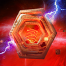
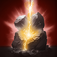
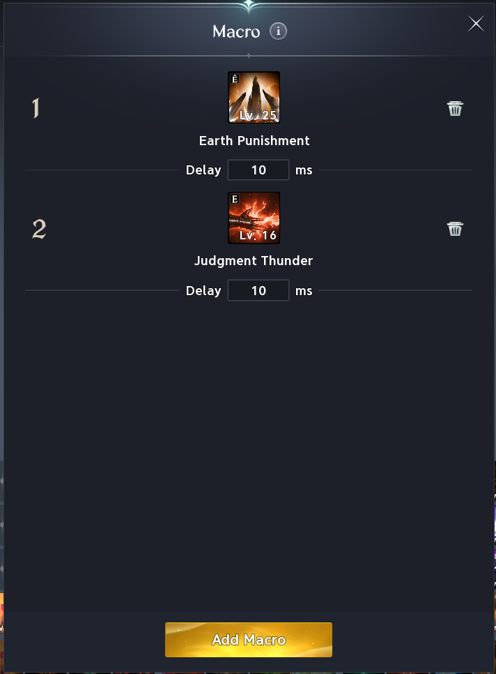

# Cleric

## Skills (PVE)

Notes:

- **Lv20 leveling priority** Condemnation > Radiant Recovery > Healing Light > Divine Aura > Earth's Retribution > Bolt

| Skill | Icon | Lvl | Specialty |
|---|---|---|---|
| **Earth’s Retribution** |  | 12 | • +20% [Discharge] Chain Skill trigger chance • -7s [Bolt] cooldown on landing [Discharge] |
| **Judgement Thunder** |  | 20 | • -20% MP consumed • 10% chance to inflict Root for 2s on landing [Divine Punishment] • Activates [Divine Punishment] 1 extra time |
| **Debilitating Mark** |  | 12 | • -15% target Defense for duration of Damage over Time • +10% PvE Damage Boost reduction and +5% PvP Damage Boost reduction |
| **Divine Aura** |  | 20 | • +50% [Divine Aura] attacking speed • +3s [Divine Aura] duration • -10s cooldown |
| **Chain of Torment** |  | 12 | • +3s Damage over Time • +10% PvE Damage Tolerance reduction and +5% PvP Damage Tolerance reduction |
| **Lightning Strike Scattershot** |  |  |  |
| **Light of Regeneration** |  | 16 | • +5% Move Speed during healing • +5% PvE Damage Tolerance and +2.5% PvP Damage Tolerance during healing |
| **Condemnation** |  | 20 | • Up to +12% damage when less targets hit • Resets cooldown on landing a Critical Hit with [Condemnation] • Multi-Hit on hit |
| **Healing Light** |  | 20 | • +2 consecutive uses • +2% HP restored • -2s cooldown |
| **Radiant Recovery** |  | 20 | • Removes up to 2 debuffs • -3s cooldown • +5% HP restored |
| **Bolt** |  | 20 | • +30% Skill Speed • Up to +20% damage when less targets hit • Critical Hit on hit |
| **Defiance** |  | 16 | • Restores 10% HP on using [Defiance] • +50% PvE Damage Tolerance and +25% PvP Damage Tolerance for Tenacity duration |

## Passives (PvE)

Notes:

- Levels are from KR/TW, which have more skill points currently than global; treat the lvl column like a target
- Descriptions are values at the level column
- **Prioritize bolded Passives:** Empyrean Lord's Grace > Earth's Grace > Healing Enhancement > Warm Benediction > Rest

| Passive | Icon | Lvl | Description |
|---|---|---|---|
| **Empyrean Lord’s Grace** |  | 32 | Increases the caster's Critical Hit by 255, Double Chance by 6.4% and deals 747-747 extra damage on landing an attack on a target. Cooldown: 1s |
| **Earth’s Grace** |  | 29 | Increases the caster's Critical Damage Boost by 24.5% and Accuracy by 100. |
| **Healing Enhancement** |  | 19 | Increases the caster's Heal Boost by 29600% of Attack. |
| **Warm Benediction** |  | 20 | Increases the caster's Max HP by 25% and Max MP by 45. |
| **Immortal Veil** |  | 16 | Increases the caster's Defense by 32% and Critical Hit Resist by 250. |
| **Heal Block** |  | 16 | Has a 7% chance to reduce the target's Incoming Heal by 62% for 5s on landing an attack. Cooldown: 5s |
| **Prayer of Concentration** |  | 16 | Forms a Protective Shield which blocks 2502 damage and increases the caster's Heal Boost by 20% for 30s when HP is 50% or less. Cooldown: 60s |
| **Survival Willpower** |  | 16 | Increases the caster's Status Effect Resist by 47%. Increases PvE Damage Tolerance by 42% and PvP Damage Tolerance by 21% for 5s when afflicted with Stun, Knockdown, Airborne, Frost, or Fear. Increases Status Effect Resist by 10% for 5s when hit while afflicted with Stun, Knockdown, Airborne, Frost, or Fear (up to 10 stacks). Damage Tolerance Increase Cooldown: 60s Status Effect Resist Increase Cooldown: 1s |
| **Radiant Benediction** |  | 8 | Restores 510-612 HP to the caster and party members within 40m on landing an attack. Cooldown: 5s |
| **Empyrean Lord’s Benediction** |  | 3 | Increases the caster's Block by 200 and restores 93-112 HP on Block. Cooldown: 3s |

## Stigmas (PvE)

Notes:

- **Lv20 leveling priority:** Earth's Punishment > Light of Protection (if no chanters) > Amplification > Noble Aura (replace LoP with that if a chanter is in the group, also superior to Amplification if high ping). Summon Resurrection can contextually be bumped to 25 during Sanctuary prog to save on stones

🟥- Mandatory 🟦- Situational 🟫- Don’t Use

| Stigma | Icon | Lvl | Notes | Category |
|---|---|---|---|---|
| **Benevolence** |  |  |  | 🟥 Mandatory |
| **Prayer of Amplification** |  |  |  | 🟥 Mandatory |
| **Earth Punishment** |  |  |  | 🟥 Mandatory |
| **Noble Aura** |  |  |  | 🟥 Mandatory |
| **Salvation** |  |  | Can be useful during fresh Sanctuary prog as a panic button | 🟦 Situational |
| **Yustiel’s Power** |  |  | Mostly unused; can see use in fresh Sanctuary prog | 🟦 Situational |
| **Absolution** |  |  | Mostly unused; can see use in fresh Sanctuary prog | 🟦 Situational |
| **Summon Resurrection** |  |  | Mandatory in raids; socket if you have room elsewhere | 🟦 Situational |
| **Light of Protection** |  |  | Mandatory if you're the only support in your group; Swap with Voice of Doom if a chanter is with you | 🟦 Situational |
| **Voice of Doom** |  |  | Replace Light of Protection if a chanter is in the group | 🟦 Situational |
| **Power Burst** |  |  | Ignore; useless | 🟫 Don't use |
| **Root** |  |  | Ignore; useless | 🟫 Don't use |
| **Assault Mark** |  |  | Ignore; useless | 🟫 Don't use |

## Macros

- Can put Amplification and Divine Aura as part of the in-game macros if you don't mind not having control over wanting to use your buff or not, and Divine Aura stopping you from casting
- Use Bolt on cooldown at MAX charge
- Do not macro support abilities

