# Gladiator

## Skills (PVE)

Notes:

- Drop minor damage nodes for life leech if needed
- **Lv20 priority:** Overhead Slam > Ruinous Blow > Rending Blow

| Skill | Icon | Lvl | Specialty |
|---|---|---|---|
| **Keen Strike** | 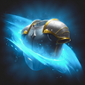 | 12 | • Absorbs 1% HP • -1s [Ruinous Blow] cooldown on hit |
| **Rending Blow** |  | 20 | • Changes to mobile skill • Deals up to 12% more damage when less targets are hit • Restores 50 MP on landing a Critical Hit |
| **Leaping Slam** | 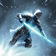 | 12 | • Prepare for Battle effect on the caster for 3s • Resets cooldown on defeating an enemy |
| **Mocking Blade** | 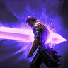 | 16 | • Absorbs 4% HP, absorbs 15% HP of target with Incapacitated Immunity • Ignores Block and Evasion and lands as Multi-Hit |
| **Overhead Slam** | 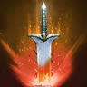 | 20 | • Adds [Upward Strike] Chain Skill • Critical Hit on hit • Remove cooldown |
| **Sword Aura Rampage** | 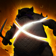 |  |  |
| **Ankle Slice** | 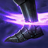 | 12 | • +16m [Ankle Slice] range • Ignores Block and Evasion and lands as Multi-Hit |
| **Crushing Wave** |  | 12 | • Absorbs 2% HP • Resets cooldown on landing a Critical Hit |
| **Rush Strike** |  | 12 | • +10m Range • -10s cooldown |
| **Aerial Snare** | 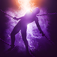 | 12 | • Multi-Hit on hit • +100% damage to targets with Incapacitated Immunity |
| **Ruinous Blow** | 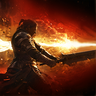 | 20 | • +20% Skill Speed • Extra damage on hit • Ignores Block and Evasion and lands as Multi-Hit |
| **Defiance** |  | 16 | • Restores 10% HP on using [Defiance] • +50% PvE Damage Tolerance and +25% PvP Damage Tolerance for Tenacity duration |

## Passives (PvE)

Notes:

- **Leveling Priority:** Attack Preparation > Impact Hit > Experienced Counterattack > Murderous Burst > Identify Weakness

| Passive | Icon | Lvl | Description |
|---|---|---|---|
| **Impact Hit** |  | 30 | Increases the caster's Impact-type Chance by 11.2% and Double Chance by 0.3%. |
| **Attack Preparation** | 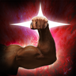 | 31 | Increases the caster's PvE Damage Boost by 5.5%, PvP Damage Boost by 2.75%, Defense by 2%, and Accuracy by 100. |
| **Experienced Counterattack** | 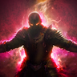 | 30 | Increases Front Attack Damage Boost by 0.4%. Increases PvE Damage Boost by 5.4%, PvP Damage Boost by 2.7% for 20s for the caster and party members on Block. PvE Damage Boost and PvP Damage Boost does not stack with Templar's [Fury] effect. |
| **Murderous Burst** |  | 20+ | Grants a stack of Menace for 3s when landing an attack. Removes Menace at 5 stacks and deals 539-539 damage to up to 4 enemies within 5m of the caster and increases the caster's Critical Damage Boost by 5.5% for 3s<mark>.</mark> |
| **Identify Weakness** |  | 15+ | Increases the caster’s Critical Hit by 100 and Perfect Chance by 0.5% |
| **Survival Stance** |  | 15+ | Increases the caster's HP by 200. Increases Max HP by an additional 7%, Natural HP Regen by 20, PvE Damage Tolerance by 5.5%, and PvP Damage Tolerance by 2.75%. |
| **Protection Armor** | 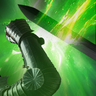 | 5-10 | Increases the caster's Block by 200 and restores 53-64 HP on Block. Cooldown: 1s |
| **Blood Absorption** | 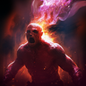 | 15 | The caster has a 50% chance to restore 20-24 HP and 1.6% Max HP on landing an attack. Immediately restores 26% Max HP when HP drops to 50% or less. Cooldown: 1s Instant Healing Cooldown: 60s |
| **Destructive Impulse** |  | 10-15 | Deals 146-146 extra damage to targets afflicted with Stagger or an Impact-type status. |
| **Survival Willpower** | 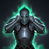 | 14-16 | Increases the caster's Status Effect Resist by 17%. Increases PvE Damage Tolerance by 12% and PvP Damage Tolerance by 6% for 5s when afflicted with Stun, Knockdown, Airborne, Frost, or Fear. Increases Status Effect Resist by 10% for 5s when hit while afflicted with Stun, Knockdown, Airborne, Frost, or Fear (up to 10 stacks). Damage Tolerance Increase Cooldown: 60s Status Effect Resist Increase Cooldown: 1s |

## Stigmas (PvE)

Notes:

- **Lv20 priority:** Lunge Stance > Zikel's Blessing > Wave Armor > Lifestealing Blade

🟥- Mandatory 🟦- Situational 🟫- Don’t Use

| Stigma | Icon | Lvl | Notes | Category |
|---|---|---|---|---|
| **Lunge Stance** | 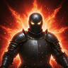 |  |  | 🟥 Mandatory |
| **Zikel’s Blessing** |  |  |  | 🟥 Mandatory |
| **Lifestealing Blade** |  |  |  | 🟥 Mandatory |
| **Rage Burst** | 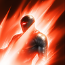 |  |  | 🟥 Mandatory |
| **Wave Armor** | 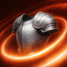 |  |  | 🟥 Mandatory |
| **Focused Block** | 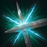 |  | Mandatory if tanking; can be substituted if not | 🟦 Situational |
| **Blade Toss** |  |  | Mainly a PvP skill, can be used over Block if not tanking for the shred | 🟦 Situational |
| **Tenaciousness** |  |  | Mainly a PvP skill, can be used over Block if not tanking for the attack bonus and immunity during prog | 🟦 Situational |
| **Armor of Balance** |  |  | PvP skill | 🟦 Situational |
| **Forced Restraint** | 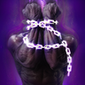 |  | Niche PvP skill | 🟦 Situational |
| **Fracturing Rush** |  |  | Niche PvP skill | 🟦 Situational |
| **Wrath Wave** |  |  | Ignore; useless | 🟫 Don't use |
| **Assault Stike** | 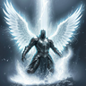 |  | Ignore; useless | 🟫 Don't use |

## Macros

- Can macro in ruinous if you don't mind it going off without your input
- Make sure to block often enough to refresh counterattack if you're the sole tank

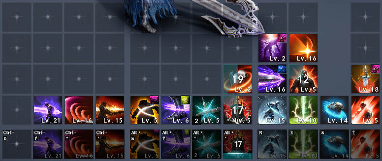

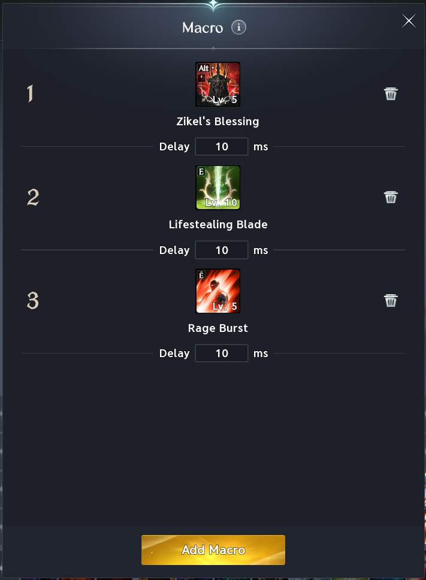
