# Ranger

## Skills (PVE)

Notes:

- **Lv20 leveling priority:** Deadshot > Gale Arrow > Drill Dart > Snipe > Burst Arrow > Tempest Shot. For skill nodes, drop less impactful DPS nodes for mobility or life leech in solo, high-end, and support-starved scenarios (Snipe, Burst Arrow, Drill Dart)

| Skill | Icon | Lvl | Specialty |
|---|---|---|---|
| **Snipe** |  | 20 | • +50% Multi-Hit on hit • -1s [Deadshot] cooldown on hit • Adds [Tempest Arrow] Chain Skill |
| **Tempest Shot** | 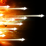 | 20 | • +10% skill Critical Hit • Deals up to 12% more damage when less targets are hit • +20% Skill Speed |
| **Snare Shot** | 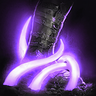 | 12 | • +20% Skill Speed • Changes to mobile skill |
| **Marking Shot** |  | 12 | • +5% Perfect Chance for the duration • +5s duration |
| **Drill Dart** |  | 20 | • +20% Skill Speed • Multi-Hit on hit • Activates [Drill Dart] 1 extra time |
| **Arrow Scattershot** |  |  |  |
| **Gale Arrow** |  | 20 | • Changes to mobile skill • Increases Combat Speed, PvE Damage Boost, and PvP Damage Boost when less targets hit • -10s cooldown |
| **Explosion Trap** | 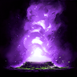 | 12 | • Pulls enemies on explosion • Extra damage after 3s on hit |
| **Burst Arrow** | 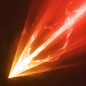 | 20 | • +50% Multi-Hit on hit • Up to +20% damage when less targets hit • 25% chance to reset cooldown on hit |
| **Suppressing Arrow** |  | 12 | • +50% Multi-Hit on hit • +20% Skill Speed |
| **Deadshot** |  | 20 | • +30% Skill Speed • Ignores Block and Evasion and lands as Multi-Hit • [Deadshot] grants extra damage on hit |
| **Defiance** |  | 16 | • Restores 10% HP on using [Defiance] • +50% PvE Damage Tolerance and +25% PvP Damage Tolerance for Tenacity duration |

## Passives (PvE)

Notes:

- **Prioritize bolded Passives:** Focused Eye > Hunter's Resolve > Hunter's Soul

| Passive | Icon | Lvl | Description |
|---|---|---|---|
| **Focused Eye** |  | 35 | Increases the caster's Attack by 20% for 10s. |
| **Hunter’s Resolve** |  | 34 | Increases the caster's Critical Damage Boost by 6%. |
| **Hunter’s Soul** |  | 22 | Has a 50% chance to deal 344-344 damage on a Critical Hit. Cooldown: 1s |
| **Vigilant Eye** |  | 14 | Increases the caster's Evasion by 200, Max HP by 6%, and restores 85-102 HP on Evasion. Cooldown: 3s |
| **Concentrated Fire** | 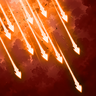 | 17 | Has a 50% chance to deal 56-56 damage to a target taking Damage over Time. Cooldown: 1s |
| **Wing Vigor** | 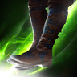 | 15 | Increases Max Stamina by 15. Increases Move Speed by 10% for 1s when attacked. Cooldown: 5s |
| **Unyielding Resolve** |  | 14 | Increases the caster's Ailment-type Resist and Impact-type Resist by 11.2%. |
| **Rooting Eye** |  | 18 | Has a 50% chance to deal 143-143 damage when landing an attack on a target afflicted with Slow or Root. Cooldown: 1s |
| **Melee Fire** | 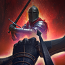 | 15 | Has a 25% chance to inflict 148-148 extra damage when landing an attack. Has a 5% chance to inflict Knock Back when landing an attack on a target within 5m. Cooldown: 1s |
| **Revitalization Contract** |  |  | Increases the caster's Status Effect Resist by 17%. Increases Status Effect Resist by 10% for 5s when hit while afflicted with Stun, Knockdown, Airborne, Frost, or Fear (up to 10 stacks). Immediately restores 35% Max HP when HP is 10% or less. Healing Cooldown: 60s Status Effect Resist Cooldown: 1s |

## Stigmas (PvE)

Notes:

- **Lv20 priority:** Vaizel's Authority > Bow of Blessing > Griffon Arrow

🟥- Mandatory 🟦- Situational 🟫- Don’t Use

| Stigma | Icon | Lvl | Notes | Category |
|---|---|---|---|---|
| **Vaizel’s Authority** | 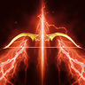 |  |  | 🟥 Mandatory |
| **Bow of Blessing** |  |  |  | 🟥 Mandatory |
| **Griffon Arrow** |  |  |  | 🟥 Mandatory |
| **Supporting Fire** |  |  |  | 🟥 Mandatory |
| **Explosive Arrow** | 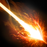 |  | Your first choice once the mandatory ones have been equipped | 🟦 Situational |
| **Mother Nature’s Breath** |  |  | Can take if there's room; useful to immediately negate nasty DoTs and to help survive tough scenarios | 🟦 Situational |
| **Ambush Kick** |  |  | PvP skill | 🟦 Situational |
| **Sealing Arrow** |  |  | PvP skill | 🟦 Situational |
| **Stealth** |  |  | Niche PvP skill | 🟦 Situational |
| **Ensnaring Trap** | 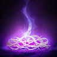 |  | Niche PvP skill | 🟦 Situational |
| **Arrow Storm** |  |  | Ignore; useless | 🟫 Don't use |
| **Illusory Arrow** | 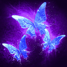 |  | Ignore; useless | 🟫 Don't use |
| **Assault Smite** |  |  | Ignore; useless | 🟫 Don't use |

## Macros

- Mouse macro software to spam LMB alongside the in-game macro to weave; can put marking shot as part of the macro but honestly wouldn't recommend it given how disruptive it is since it doesn't need to be used on CD but rather when the buff is about to fall off. Deadshot on cooldown; be wary of resets on it to spam if needed (it loves to reset twice in a row).
- Only use Explosion Trap on trash packs to gather them up

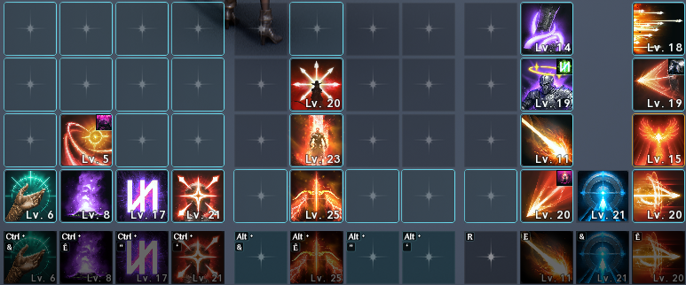

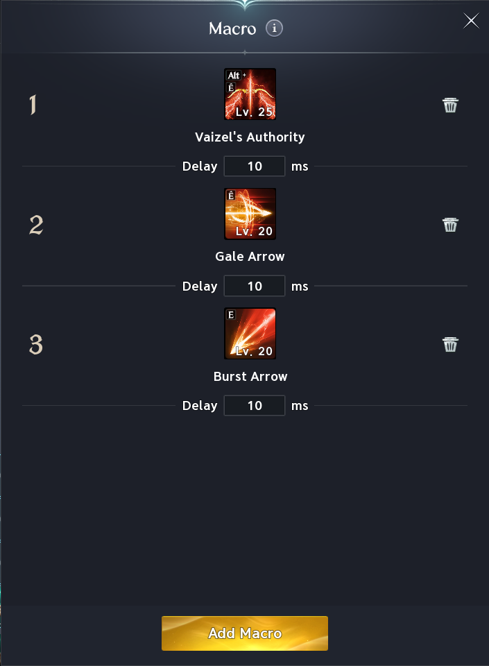
