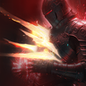
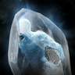
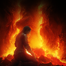
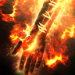
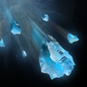
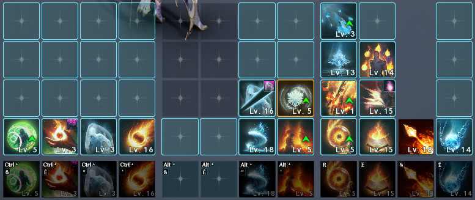
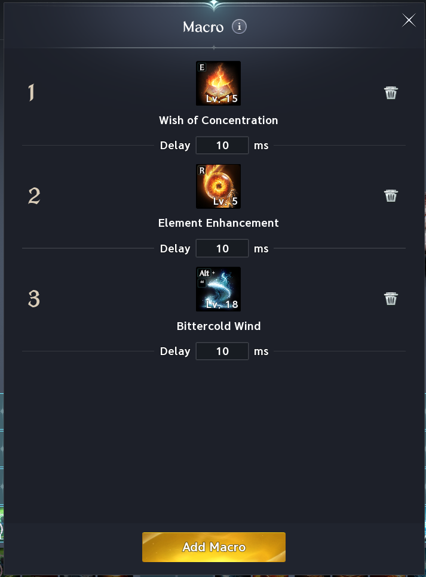

# Sorcerer

## Skills (PVE)

Notes:

- Frost Burst can be dropped to gain a bit of DPS if you don't care for the lifeleech. You can swap some nodes around for lifeleech if needed.
- **Lv20 priority** Hellfire > Wish of Concentration > Firestorm > Blaze > Flame Arrow > Bittercold Wind

| Skill | Icon | Lvl | Specialty |
|---|---|---|---|
| **Flame Arrow** |  | 20 | • +50% Multi-Hit on hit • Inflicts Fire Mark for 5s on landing [Pyroclasm] • Reset [Blaze] cooldown on landing [Pyroclasm] |
| **Ice Chain** |  | 12 | • +20% Skill Speed • Deals up to 12% more damage when less targets are hit |
| **Firestorm** |  | 20 | • +20% Skill Speed • -2s [Hellfire] cooldown per fireball • +15% damage per fireball, up to +75% |
| **Bittercold Wind** |  | 20 | • +1s [Bittercold Wind] summon duration • Changes to mobile skill • Ignores Block and Evasion and lands as a Critical Hit |
| **Blaze** |  | 20 | • Absorbs 3% HP • Delayed Damage after 3s • -3s [Wish of Concentration] cooldown on hit |
| **Flame Scattershot** |  | 16 | • Multi-Hit on hit • -1s all skill cooldowns on hit |
| **Frost** |  | 12 | • Restores 200 MP • -5s cooldown |
| **Winter’s Shackle** |  | 16 | • +20% PvE Damage Boost and +10% PvP Damage Boost for 5s on landing [Winter's Shackles] • -15s [Winter's Shackles] cooldown |
| **Frost Burst** |  | 12 | • Absorbs 7% HP • Changes to mobile skill |
| **Wish of Concentration** |  | 20 | • +10% additional Attack • +10% Combat Speed • -10s all skill cooldowns |
| **Hellfire** |  | 20 | • +30% Skill Speed • Changes to mobile skill • -15s cooldown |
| **Defiance** |  | 16 | • Restores 10% HP on using [Defiance] • +50% PvE Damage Tolerance and +25% PvP Damage Tolerance for Tenacity duration |

## Passives (PvE)

Notes:

- **Prioritize Robe of Flame**

| Passive | Icon | Lvl | Description |
|---|---|---|---|
| **Robe of Flame** |  | 31 | Increases the caster's Accuracy by 100, PvE Damage Boost by 1%, PvP Damage Boost by 0.5%, and Double Chance by 0.2%. |
| **Fire Mark** |  | 16 | Has a 20% chance to inflict Fire Mark for 5s on landing a Fire attack. Fire Mark: Has a 20% chance to take 32-32 extra damage when taking Fire damage while afflicted with Fire Mark. Cooldown: 1s |
| **Robe of Earth** |  | 18 | Increases Max MP by 7% and Natural MP Regen by 5. Increases Critical Hit by 105 when MP is 50% or more. |
| **Cold Snap** |  | 14 | Has a 50% chance to deal 43-43 extra damage when landing an attack on a target afflicted with Slow. Cooldown: 1s |
| **Robe of Cold** |  | 17 | Increases the caster's Defense by 1% and Critical Hit Resist by 55 and inflicts Slow on an enemy when struck by them, reducing the enemy's Move Speed by 25% for 2s. Cooldown: 10s |
| **Absorb Essence** |  | 16 | Increases Ailment-type and Mental-type Chance by 10.7% and restores 25 MP on landing an attack. Cooldown: 1s |
| **Grace of Resistance** |  | 17 | Increases the caster's Mental-type Resist and Impact-type Resist by 11.2%. |
| **Grace of Enhancement** |  | 8 | Increases the caster's PvE Damage Boost by 20% and PvP Damage Boost by 10% when the caster's MP is 25% or more, and has a 50% chance to deal 106-106 damage on landing an attack. Cooldown: 1s |
| **Revitalization Contract** |  | 16 | Increases the caster's Status Effect Resist by 17%. Increases Status Effect Resist by 10% for 5s when hit while afflicted with Stun, Knockdown, Airborne, Frost, or Fear (up to 10 stacks). Immediately restores 35% Max HP when HP is 10% or less. Healing Cooldown: 60s Status Effect Resist Cooldown: 1s |
| **Vitality Evaporation** |  | 15 | Deals 261-261 damage on hit if the target's HP is above 70%. Cooldown: 1s |

## Stigmas (PvE)

Notes:

- **Lv20 priority:** Element Enhancement > Fire Wall > Delayed Explosion

🟥- Mandatory 🟦- Situational 🟫- Don’t Use

| Stigma | Icon | Lvl | Notes | Category |
|---|---|---|---|---|
| **Element Enhancement** |  |  | 1st Prio | 🟥 Mandatory |
| **Cold Storm** |  |  | 4th Prio | 🟥 Mandatory |
| **Fire Wall** |  |  | 2nd Prio | 🟥 Mandatory |
| **Delayed Explosion** |  |  | 3rd Prio | 🟥 Mandatory |
| **Steel Barrier** |  |  | Good utility defensive option after mandatory stigmas | 🟦 Situational |
| **Divine Burst** |  |  | Decent DPS option if you Don't run Steel Barrier | 🟦 Situational |
| **Glacial Smite** |  |  | First choice of DPS filler after mandatory stigmas | 🟦 Situational |
| **Hibernation** |  |  | Very niche use case during early sanctuary prog in emergency scenarios | 🟦 Situational |
| **Arctic Armor** |  |  | PvP skill | 🟦 Situational |
| **Soul Freeze** |  |  | PvP skill | 🟦 Situational |
| **Curse: Tree** |  |  | Ignore; useless | 🟫 Don't use |
| **Lumiel’s Space** |  |  | Ignore; useless | 🟫 Don't use |
| **Assault Bombardment** |  |  | Ignore; useless | 🟫 Don't use |

## Macros

- Hellfire on engage; drop ground debuffs on CD as they come back, pump as much Hellfire as possible with CDR procs.
- Mouse macro software for LMB alongside in-game macro.

