# Spirit Master

## Skills (PVE)

Notes:

- Drop minor damage nodes for lifeleech if needed.
- **Lv20 priority** Elemental Fusion > Fire Spirit > Combustion

| Skill | Icon | Lvl | Specialty |
|---|---|---|---|
| **Cold Shock** |  | 16 | • +50% Multi-Hit on hit • +2% Attack on landing [Earth Tremor] (Up to 5 stacks) |
| **Combustion** | 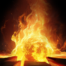 | 20 | • Deals up to 12% more damage when less targets are hit • +20% Skill Speed • Adds [Ashy Call] Chain Skill |
| **Fire Spirit** | 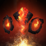 | 20 | • +20% Fire Spirit Critical Hit damage • 10% chance to activate skill when Fire Spirit lands an attack • +20% Fire Spirit Stats |
| **Water Spirit** |  | 16 | • +10% Water Spirit Attack • +20% Water Spirit Stats |
| **Jointstrike: Curse** |  | 16 | • +50% Multi-Hit on hit • Changes to mobile skill • [Jointstrike: Curse] ignores Block and Evasion and lands as a Critical Hit |
| **Rapid Scattershot** |  | 16 |  |
| **Earth Spirit** |  | 12-16 | • 10% chance to activate skill when Earth Spirit lands an attack • +20% Earth Spirit Stats |
| **Dimensional Control** |  | 20 | • Extra damage after 3s on hit • +50% Multi-Hit chance on hit |
| **Wind Spirit** |  | 1-8 |  |
| **Soul’s Cry** |  | 8-12 | • 70% chance to inflict Fear for 5s PvP targets • 100% chance to inflict Fear on NPC targets |
| **Elemental Fusion** |  | 20 | • Extra damage after 3s on hit • +10 all Element Boost on hit • 25% chance to regain Four Elements |
| **Defiance** |  | 12-16 | • Restores 10% HP on using [Defiance] • +50% PvE Damage Tolerance and +25% PvP Damage Tolerance for Tenacity duration |

## Passives (PvE)

Notes:

- **Leveling Priority:** Spirit Strike > Mental Focus > Elemental Unification > Spirit Revitalization

| Passive | Icon | Lvl | Description |
|---|---|---|---|
| **Spirit Strike** | 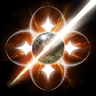 | 30 | Increases the caster's PvE Damage Boost by 6%, PvP Damage Boost by 3%, and Perfect Chance by 0.4%. Increases the Spirit's PvE Damage Boost by 6%, PvP Damage Boost by 3%, and Perfect Chance by 0.4%. |
| **Mental Focus** | 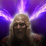 | 30 | Increases the caster's Mental-type Chance(s) by 11% and Double Chance by 0.3%. |
| **Elemental Unification** |  | 30 | Increases Critical Damage Boost by 1.1% for the caster and Spirit for 10s upon landing a Spirit skill attack. Stacks up to 5 times. Cooldown: 1s |
| **Spirit Revitalization** |  | 24 | Has a 11% chance to reduce the cooldown of Spirit summon skills by 1s on hit. Immediately heals the Spirit for 12% of its Max HP when its HP is 50% or less. Cooldown: 1s Spirit Healing Cooldown: 30s |
| **Spirit Protection** |  | 14 | Increases the caster's Defense by 2% and Spirit's Defense by 2%. |
| **Corrode** |  | 23 | Increases the caster's Critical Hit by 100, with a 50% chance to deal 124-124 damage on landing a Critical Hit. Cooldown: 1s |
| **Spirit’s Descent** |  | 16 | Has a 50% chance to deal 47-47 extra damage whenever the Spiritmaster's attacks land within 10 seconds of summoning a Spirit. Duration is increased to 30s when an Ancient Spirit is summoned. Cooldown: 1s |
| **Revitalization Contract** |  | 15 | Increases the caster's Status Effect Resist by 17%. Increases Status Effect Resist by 10% for 5s when hit while afflicted with Stun, Knockdown, Airborne, Frost, or Fear (up to 10 stacks). Immediately restores 35% Max HP when HP is 10% or less. Healing Cooldown: 60s Status Effect Resist Cooldown: 1s |
| **Consecutive Countercurrent** | 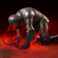 | 16 | Has a 50% chance to deal 97-97 extra damage on landing an attack on a target that is taking Damage over Time. Cooldown: 1s |
| **Spirit Communion** |  | 14 | Increases the caster's Accuracy by 100. Has a 10% chance to restore the caster's and Spirit's HP by 182-200 when landing an attack. Cooldown: 1s |

## Stigmas (PvE)

Notes:

- **Lv20 priority** Flame Blessing > Jointstrike: Corrode > Ancient Spirit

🟥- Mandatory 🟦- Situational 🟫- Don’t Use

| Stigma | Icon | Lvl | Notes | Category |
|---|---|---|---|---|
| **Enhance: Spirit’s Benediction** |  |  | 4th Prio | 🟥 Mandatory |
| **Flame Blessing** |  |  | 1st Prio | 🟥 Mandatory |
| **Ancient Spirit** | 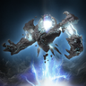 |  | 3rd Prio | 🟥 Mandatory |
| **Jointstrike: Corrode** |  |  | 2nd Prio | 🟥 Mandatory |
| **Jointstrike: Destruction** | 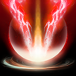 |  | Your 5th choice, good for debuff uptime | 🟦 Situational |
| **Siphon** |  |  | One of your 6th options, interchangeable with Proxy depending on the situation | 🟦 Situational |
| **Command: Proxy** |  |  | Solid swap-in if you need more sustain in a raiding scenario | 🟦 Situational |
| **Cursed Cloud** |  |  | PvP skill | 🟦 Situational |
| **Kaisinel’s Power** |  |  | PvP skill | 🟦 Situational |
| **Seize Magic** | 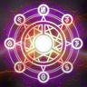 |  | PvP skill | 🟦 Situational |
| **Magic Block** |  |  | PvP skill | 🟦 Situational |
| **Cry of Terror** | 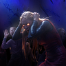 |  | Ignore; useless | 🟫 Don't use |
| **Assault Terror** |  |  | Ignore; useless | 🟫 Don't use |

## Macros

- Mouse macro software to spam LMB alongside the in-game macro to weave.\
  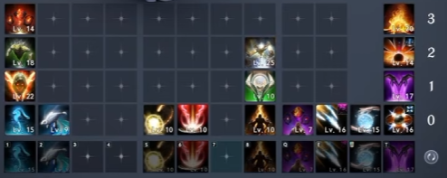 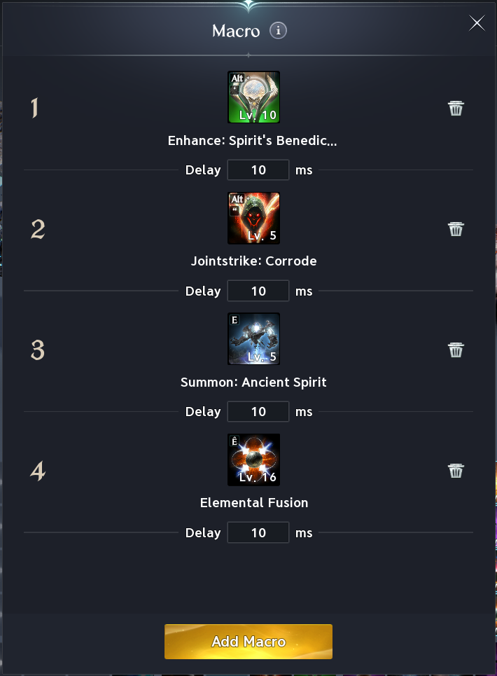
