# Templar

## Skills (PVE)

Notes:

- Drop minor damage nodes for life leech if needed.
- **Lv20 priority** Judgement > Pummel > Punishment > Vicious Strike

| Skill | Icon | Lvl | Specialty |
|---|---|---|---|
| **Vicious Strike** |  | 20 | • +50% Multi-Hit on hit • -2s [Warding Strike] cooldown on hit • Adds [Threatening Blow] Chain Skill |
| **Pummel** | 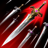 | 20 | • Deals up to 12% more damage when less targets are hit • -1s [Punishment] cooldown on landing [Punishing Strike] • Activates [Punishing Strike] 1 extra time |
| **Poach** |  | 15 | • Moves to the target if the target has Incapacitated Immunity • 10% Max HP Protective Shield |
| **Shield Smite** |  | 16 | • 50% chance to trigger [Debilitating Smash] on hit • -2s cooldown |
| **Judgement** | 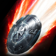 | 20 | • Extra damage on hit • Critical Hit on hit • Remove cooldown |
| **Flash Rampage** | 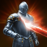 | 6 |  |
| **Debilitating Smash** |  | 14 | • +3s Debilitate duration • Ignores Block and Evasion and lands as Multi-Hit |
| **Warding Strike** |  | 16 | • -5s cooldown • +10% PvE Damage Tolerance and +5% PvP Damage Tolerance to party members on skill use |
| **Shield Rush** |  | 15 | • +10m Range • -10s cooldown |
| **Annihilate** | 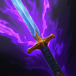 | 16 | • +100% damage to targets with Incapacitated Immunity • -10s cooldown |
| **Punishment** |  | 20 | • +30% Skill Speed • Changes to mobile skill • Ignores Block and Evasion and lands as a Critical Hit |
| **Defiance** |  | 14 | • Restores 10% HP on using [Defiance] • +50% PvE Damage Tolerance and +25% PvP Damage Tolerance for Tenacity duration |

## Passives (PvE)

Notes:

- **Leveling Priority:** Fury > Impact Hit > Insulting Roar

| Passive | Icon | Lvl | Description |
|---|---|---|---|
| **Fury** |  | 33 | Increases Front Attack Damage Boost by 0.3% for the caster, and increases PvE Damage Boost by 5.5% and PvP Damage Boost by 2.75% for 20s for the caster and party members on Block. Cooldown: 1s |
| **Impact Hit** |  | 29 | Increases the caster's Impact-type Chance by 11.2% and Double Chance by 0.3%. |
| **Insulting Roar** | 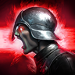 | 32 | Increases Enmity Boost by 100% for the caster and increases Attack by 5.5% for 5s on landing a Front Attack. Cooldown: 5s |
| **Ironclad Defense** |  | 18 | Increases the caster's Defense by 7% and Endurance by 1%. |
| **Enhance Health** |  | 17 | Increases the caster's HP by 250. Increases Max HP by an additional 7.5% and Incoming Heal by 6%. |
| **Warding Shield** |  | 11 | Increases the caster's Block by 200 and restores 53-64 HP on Block. Cooldown: 3s |
| **Punishing Benediction** |  | 19 | Increases the caster's Critical Hit by 100 and grants Punishing Benediction for 10s when landing an attack. Punishing Benediction: Has a 50% chance to deal 69-69 extra damage to the target when landing an attack. Cooldown: 1s |
| **Guarding Seal** |  | 14 | Grants a Guarding Seal that blocks damage equal to 21% of Max HP for 30s when HP is 50% or less. Cooldown: 60s |
| **Survival Willpower** |  | 16 | Increases the caster's Status Effect Resist by 17%. Increases PvE Damage Tolerance by 12% and PvP Damage Tolerance by 6% for 5s when afflicted with Stun, Knockdown, Airborne, Frost, or Fear. Increases Status Effect Resist by 10% for 5s when hit while afflicted with Stun, Knockdown, Airborne, Frost, or Fear (up to 10 stacks). Damage Tolerance Increase Cooldown: 60s Status Effect Resist Increase Cooldown: 1s |
| **Block Pain** |  | 15 | Grants Block Pain for 10s when struck by an enemy. Block Pain: Increases PvE Damage Tolerance by 11% and PvP Damage Tolerance by 5.5% Cooldown: 20s |

## Stigmas (PvE)

Notes:

- **Lv20 priority:** Taunt > Battlefield Banner > Shield of Protection > Noble Armor

🟥- Mandatory 🟦- Situational 🟫- Don’t Use

| Stigma | Icon | Lvl | Notes | Category |
|---|---|---|---|---|
| **Shield of Protection** |  |  | 3rd Prio | 🟥 Mandatory |
| **Taunt** |  |  | 1st Prio | 🟥 Mandatory |
| **Doom Shield** | 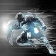 |  | 5th Prio (Can be used for raids for better movement) | 🟥 Mandatory |
| **Noble Armor** | 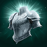 |  | 4th Prio | 🟥 Mandatory |
| **Battlefield Banner** |  |  | 2nd Prio | 🟥 Mandatory |
| **Executing Blade** | 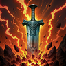 |  | Best option after mandatory skills | 🟦 Situational |
| **Empyrean Lord’s Punishment** |  |  | Decent endgame option | 🟦 Situational |
| **Grapple** |  |  | PvP skill | 🟦 Situational |
| **Second Skin** |  |  | Niche PvP skill | 🟦 Situational |
| **Comrade in Arms** |  |  | Niche PvP skill | 🟦 Situational |
| **Armor of Balance** |  |  | Niche PvP skill | 🟦 Situational |
| **Nezekan’s Shield** | 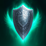 |  | Niche PvP skill | 🟦 Situational |
| **Assault Fury** |  |  | Ignore; useless | 🟫 Don't use |

## Macros

- Punishment separate, full charge
- Make sure to block often enough to refresh Fury
- Use macro software to spam LMB alongside in-game macro to weave
- Possible to drop shield smite entirely (replace it with annihilate and put annihilate first in line if so); DPS is about the same but removes the inconvenience of the movement lock

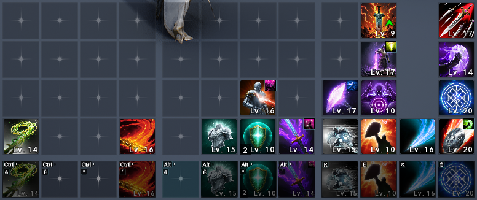

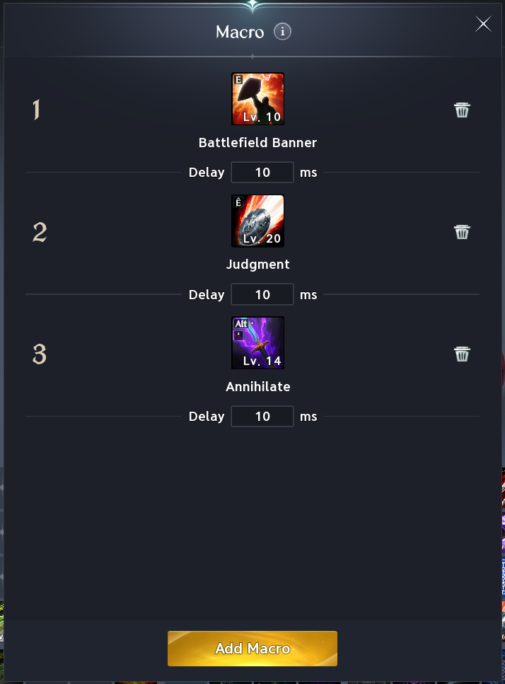
